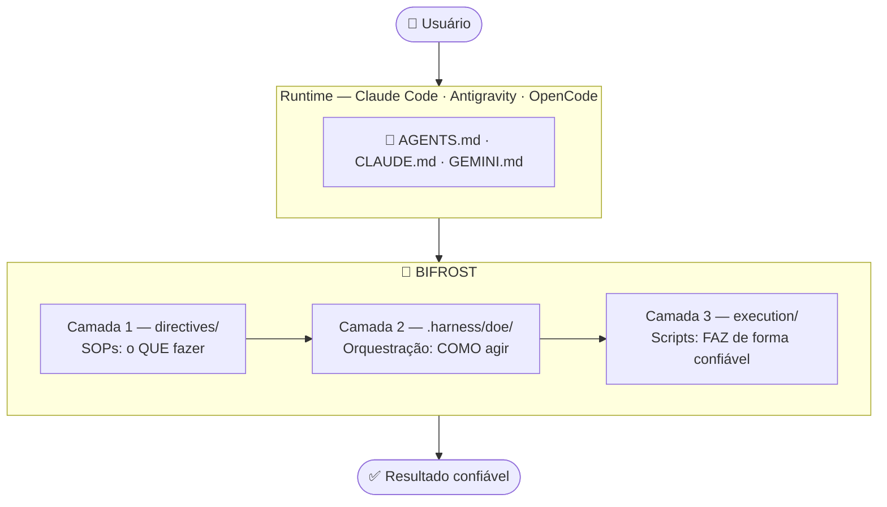
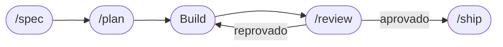
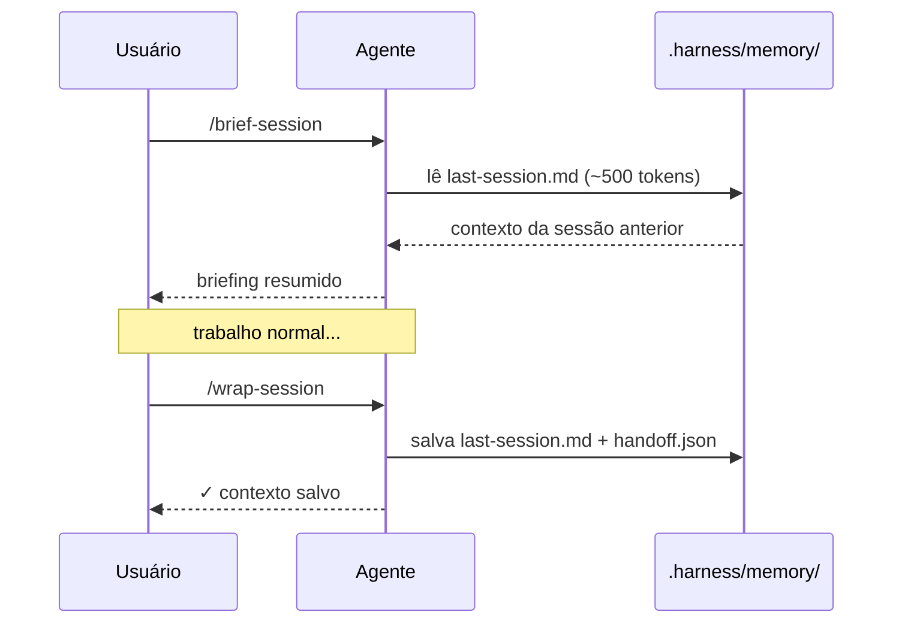

<div align="center">

```
██████╗ ██╗███████╗██████╗  ██████╗ ███████╗████████╗
██╔══██╗██║██╔════╝██╔══██╗██╔═══██╗██╔════╝╚══██╔══╝
██████╔╝██║█████╗  ██████╔╝██║   ██║███████╗   ██║
██╔══██╗██║██╔══╝  ██╔══██╗██║   ██║╚════██║   ██║
██████╔╝██║██║     ██║  ██║╚██████╔╝███████║   ██║
╚═════╝ ╚═╝╚═╝     ╚═╝  ╚═╝ ╚═════╝ ╚══════╝   ╚═╝
```

**Use the agent you want.**
**Bifrost provides the engineering system around it.**

*A portable, zero-infrastructure harness for context, memory,*
*execution, and verification across AI coding runtimes.*

[](https://www.npmjs.com/package/harness-engineering)
[](LICENSE)
[](#changelog)
[](#compatibilidade)

</div>

---

## O problema que ninguém fala

Você dá uma tarefa ao Claude Code. Ele começa bem — lê arquivos, escreve código, parece produtivo. Depois algo vai errado. Ele pula um passo. Quebra um teste. Diz "feito" mas nada funciona. Você gasta mais tempo limpando do que se tivesse feito você mesmo.

> *"Às vezes você empilha lixo no contexto e impede o agente de ter eficiência."*

**Isso não é problema do modelo. É problema de harness.**

A Anthropic demonstrou isso em experimento controlado:

```
Mesmo modelo (Opus 4.5) · Mesmo prompt ("build a 2D retro game editor")

❌ Sem harness  →  $9 · 20 minutos · não funcionou
✅ Com harness  →  $200 · 6 horas · jogo jogável e funcional
```

A diferença não foi o modelo. Foi o ambiente ao redor dele.

---

## O que é o Bifrost

Na mitologia nórdica, **Bifrost** é a ponte que conecta todos os mundos.

```
╔══════════════════════════════════════════════════════╗
║                     BIFROST                          ║
║                                                      ║
║   Claude Code  ─────┐                                ║
║   Antigravity  ─────┼──── AGENTS.md ──── seu projeto ║
║   OpenCode     ─────┤     CLAUDE.md                  ║
║   Cursor       ─────┘     GEMINI.md                  ║
║                                                      ║
║   Um harness. Qualquer runtime. Mesmas regras.       ║
╚══════════════════════════════════════════════════════╝
```

```
Prompt Engineering    →  você funciona
Context Engineering   →  você é consistente
Harness Engineering   →  você é confiável em produção
```

---

## Os 5 Princípios

```
1. Runtime Agnostic
   Funciona em Claude Code, Antigravity, OpenCode, Cursor.
   Mesmas regras. Qualquer runtime.

2. Zero Infrastructure
   Sem servidor, banco, API ou serviço externo.
   npx + Markdown + scripts locais. Nada mais.

3. Minimum Sufficient Context
   Carregue o mínimo necessário — e suficiente.
   Zero contexto também é erro. O objetivo é mínimo E suficiente.

4. Deterministic Over Probabilistic
   Scripts determinísticos > agente improvisando.
   Se existe um script, use o script.

5. Failures Improve the Harness
   Falhas recorrentes geram aprendizado permanente.
   Erros isolados: registrar e avaliar antes de virar regra.
```

Toda nova feature passa pelo teste: *"Respeita os 5 princípios?"*

---

## Instalação

> Requisito: [Node.js 16+](https://nodejs.org)

```bash
npx harness-engineering
```

```bash
npx harness-engineering check    # verifica integridade
npx harness-engineering stats    # métricas de sessões
npx harness-engineering diff     # visão semântica do que mudou
npx harness-engineering skill --list  # skills disponíveis
```

---

## Arquitetura de 3 Camadas



---

## Como Usar no Dia a Dia

### Prompt universal — qualquer runtime

```
Leia .harness/index.md e carregue apenas a directive
com match para esta tarefa.

Antes de executar, classifique minha intenção:
pesquisa / implementação / investigação / correção / revisão

Tarefa: [DESCREVA]

Protocolo PEV:
PLAN    → critérios verificáveis antes de qualquer código
EXECUTE → dentro do plano aprovado
VERIFY  → máximo 3 linhas de resposta
```

### Ciclo SDLC completo (Claude Code)



### Memória entre sessões



---

## Hierarquia de Memória

```
L0 — AGENTS.md              → sempre presente · nunca descartar
L1 — .harness/index.md      → sempre presente · nunca descartar
L2 — .harness/domains/      → carregado sob demanda
L3 — directives/ · skills/  → carregado por match
L4 — memory/last-session.md → descartável após /wrap-session
```

---

## Dois Tipos de Memória

| | SESSION MEMORY | LEARNING MEMORY |
|--|---------------|-----------------|
| Arquivo | `last-session.md` | `harness-evolution.md` |
| Propósito | Temporário · contextual | Permanente · acumulado |
| Responde | "Onde estávamos?" | "O que aprendemos?" |
| Duração | Descartável | Nunca apagar |

---

## Token Filter

O contexto certo, não o contexto todo:

```
TASK → INDEX → RELEVÂNCIA → CONTEXTO MÍNIMO SUFICIENTE → AGENTE
```

| Técnica | Redução |
|---------|---------|
| Lazy Loading | -80% |
| Progressive Disclosure | -70% |
| Observation Masking | -52% |
| Roteamento de Modelos | até -95% |
| Compressão de Histórico | -45% |

---

## Três Tiers de Permissão

```
✅ PODE sem pedir    → ler arquivos, rodar testes, gerar código
⚠️  PERGUNTAR antes  → deletar, instalar deps, git commit/push
🚫 NUNCA            → protected_paths, reset --hard, credenciais
```

---

## Princípios Karpathy

```
1. Declare suposições antes de agir
2. Código mínimo — nada especulativo
3. Mudanças cirúrgicas — toque só o que deve
4. Transforme tarefas em critérios verificáveis
```

---

## Regra de Hashimoto

> *Cada bug que não vira regra do harness é um bug que vai acontecer de novo.*

```
Erro isolado   → registrar · avaliar · não vira regra automaticamente
Erro recorrente → Hashimoto → melhoria permanente → regression case
```

```bash
python execution/self-correction.py --auto
```

---

## Quality Gate

| Verificação | O que bloqueia |
|-------------|----------------|
| 🔑 Segredos | passwords, api_keys, tokens hardcoded |
| 📝 `console.log` | logs soltos em JS/TS |
| ⚠️ TypeScript `any` | sem `// harness-ignore` |
| 💰 Float monetário | valores monetários em ponto flutuante |
| 🔒 `.env` | commit sem ser `.example` |
| 🛡️ Protected paths | `.harness/config.json` |
| 🔄 Auto-sync | AGENTS.md → CLAUDE.md + GEMINI.md |
| 🧠 Auto-Hashimoto | self-correction.py roda a cada commit |

---

## Compatibilidade

| Runtime | Arquivo | SDLC | Memória |
|---------|---------|------|---------|
| Claude Code | `CLAUDE.md` | `/spec /plan /review /ship` | `/wrap-session` |
| Antigravity | `GEMINI.md` | prompt direto | manual |
| OpenCode | `AGENTS.md` | prompt direto | manual |
| Cursor | `.cursorrules` | prompt direto | manual |

---

## Community Skills

```bash
npx harness-engineering skill nextjs
npx harness-engineering skill python-fastapi
npx harness-engineering skill lgpd
npx harness-engineering skill --list
```

> Contribua: [bifrost-community-skills](https://github.com/JRoberto1/bifrost-community-skills)

---

## Changelog

### v3.0.1
- ✨ Token Filter semântico no .harness/index.md
- ✨ Regression cases A/B/C/D/E/U
- ✨ Failure Taxonomy formal
- ✨ .harness/tests/ com casos DS-001, DS-002, DEP-001, SEC-001
- ✨ CONTRIBUTING.md com convenção de commits semânticos
- ✨ npm publicado como v3.0.1

### v2.6.0
- ✨ Auto-Hashimoto no pre-commit — self-correction.py roda a cada commit
- ✨ 5 Princípios Oficiais integrados ao AGENTS.md e README
- ✨ Frase de posicionamento: "Use the agent you want."
- ✨ Regra Anti-Directive Hell no AGENTS.md

### v2.5.0
- ✨ `directives/office-hours.md` — 6 perguntas de reframing
- ✨ `execution/handoff.py` — WIP commits estruturados
- ✨ `/ship` — Document Release integrado

### v2.4.0
- ✨ Context7 — documentação atualizada antes de implementar
- ✨ `.harness/skills/context7/SKILL.md`

### v2.3.0
- ✨ Viés do Avaliador no `/review`
- ✨ `execution/validate_action.py` — validação programática
- ✨ `execution/handoff.py` — handoff JSON estruturado

### v2.2.0
- ✨ `npx harness-engineering stats`
- ✨ `execution/self-correction.py` — Hashimoto automático
- ✨ Community Skills — Next.js, FastAPI, LGPD

### v2.1.0
- ✨ Hierarquia L0→L4 · Três Tiers de Permissão
- ✨ SupervisorAgent — 3 gatilhos automáticos
- ✨ `claude-progress.txt`

### v2.0.0
- ✨ Camada 2 `.harness/doe/` · Intent Gate · Princípios Karpathy
- ✨ Ciclo SDLC completo · agents/ · config.schema.json

### v1.x
- v1.4.0: Nome Bifrost · config.json · harness-evolution.md
- v1.3.0: Progressive Disclosure · Observation Masking · roteamento
- v1.2.0: Lazy loading · compress-history.py · /context-check
- v1.1.0: Memória persistente · /wrap-session · /brief-session
- v1.0.0: Estrutura base · DOE · PEV · 4 domínios · npm

---

## Princípios

```
 1. Agente = Modelo + Harness
 2. Marcha dos Noves — o harness resolve
 3. Directives são documentos vivos
 4. Scripts determinísticos > agente improvisando
 5. Verificador com contexto limpo
 6. Sucesso silencioso, falha barulhenta
 7. Hashimoto — cada erro melhora o harness
 8. Memória persistente          · v1.1.0
 9. Contexto mínimo suficiente   · v1.2.0
10. Modelo certo para cada tarefa · v1.3.0
11. Intenção antes de execução    · v2.0.0
12. Spec antes de código          · v2.0.0
13. Ceticismo ativo no review     · v2.3.0
14. Validação antes da ação       · v2.3.0
15. Docs atualizadas antes de deploy · v2.5.0
16. Minimum Sufficient Context    · v2.6.0
17. Failures Improve the Harness  · v2.6.0
```

---

## Licença

MIT — use, modifique, distribua, contribua.

---

<div align="center">

*Na mitologia nórdica, Bifrost é a ponte que conecta todos os mundos.*
*Aqui, conecta seus projetos a qualquer agente de IA.*

**[⭐ Star](https://github.com/JRoberto1/Bifrost_Harness-Engineering) · [📦 npm](https://www.npmjs.com/package/harness-engineering) · [🤝 Community](https://github.com/JRoberto1/bifrost-community-skills)**

</div>
